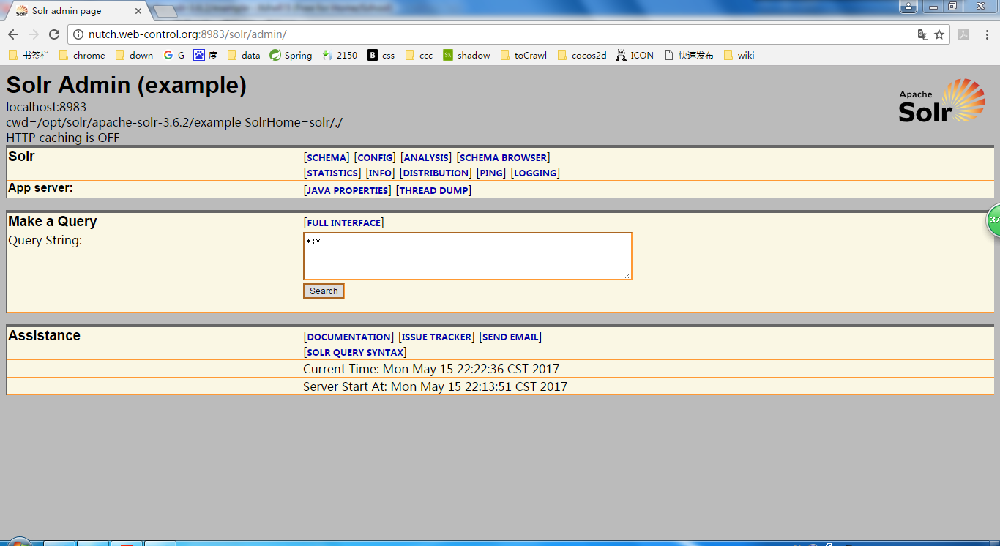

## 01.准备
  
本章介绍Apache Nutch的安装，同时提供了如何利用他进行crwl,parse,以及创建plugin的方法。

基本环境
>Centos 6.8x64 on VM

>Xshell

>vim

#### 1.介绍

可单机运行，也可以在分布式环境中使用。<br/>
可以很方便的集成Apache Solr。

#### 2.安装以及配置Apache  Nutch

##### 2.1安装Java(版本不同操作可能会有所差异)

1)opt目录下创建java文件夹
```
cd /opt && mkdir java && cd java
```
2)进入[java官网](http://www.oracle.com/technetwork/java/javase/downloads/)找到javaSE8Linux x64版本的tar下载地址 url

```
wget http://download.oracle.com/otn-pub/java/jdk/8u131-b11/d54c1d3a095b4ff2b6607d096fa80163/jdk-8u131-linux-x64.tar.gz
```
3)解压文件
```
tar -zxvf jdk-8u131-linux-x64.tar.gz
```
4)编辑/etc/profile文件
```
vim /etc/profile
```
5)文件最后添加以下内容,保存退出
```
export JAVA_HOME=/opt/java/jdk1.8.0_121
export PATH=$JAVA_HOME/bin:$PATH
```

6)使修改生效
```
source /etc/profile
```
7)测试java是否安装成功
```
java -version
```
结果如下显示，表示配置成功
```
java version "1.8.0_121"
Java(TM) SE Runtime Environment (build 1.8.0_121-b13)
Java HotSpot(TM) 64-Bit Server VM (build 25.121-b13, mixed mode)
```
##### 2.2安装Ant
1)opt目录下创建ant目录
```
cd /opt && mkdir ant && cd ant
```
2)进入[Ant官网](http://ant.apache.org/bindownload.cgi),找到ant1.10.1版本的tar下载地址
```
wget http://apache.fayea.com//ant/binaries/apache-ant-1.10.1-bin.tar.gz
```
3)解压文件
```
tar -zxvf apache-ant-1.10.1-bin.tar.gz
```
4)编辑/etc/profile文件
```
vim /etc/profile
```
5)文件最后添加以下内容，然后保存退出
```
export ANT_HOME=/opt/ant/apache-ant-1.10.1
export PATH=$ANT_HOME/bin:$PATH
```
6)使修改生效
```
source /etc/profile
```
7)测试ant是否安装成功
```
ant -version
```
显示一下内容，表示配置成功
```
Apache Ant(TM) version 1.10.1 compiled on February 2 2017
```

##### 2.3安装Apache Nutch以及Hbase
1)opt目录下创建nutch目录，以及hbase目录
```
cd /opt && mkdir nutch && mkdir hbase && cd nutch
```
2)进入[Nutch2.2.1文件下载目录](http://archive.apache.org/dist/nutch/2.2.1/),找到tar版本的下载地址
```
wget http://archive.apache.org/dist/nutch/2.2.1/apache-nutch-2.2.1-src.tar.gz
```
3)解压文件
```
tar -zxvf apache-nutch-2.2.1-src.tar.gz
```
4)写换到Hbase的目录
```
cd /opt/hbase
```
5)进入[Hbase0.90.4文件下载目录](http://archive.apache.org/dist/hbase/hbase-0.90.4/),找到tar版本的下载地址
```
wget http://archive.apache.org/dist/hbase/hbase-0.90.4/hbase-0.90.4.tar.gz
```
6)解压文件
```
tar -zxvf hbase-0.90.4.tar.gz
```
***
7)创建数据目录以及zookeeper数据目录
```
cd hbase-0.90.4 && mkdir data && mkdir zookeeperdata
```
8)编辑Hbase conf目录下的hbase-site.xml
```
vim /opt/hbase/hbase-0.90.4/conf/hbase-site.xml
```
9)configuration标签内部中添加以下内容,保存退出
```
<property>
	<name>hbase.rootdir</name>
	<value>file:///opt/hbase/hbase-0.90.4/data</value>
</property>
<property>
	<name>hbase.zookeeper.property.dataDir</name>
	<value>file:///opt/hbase/hbase-0.90.4/zookeeperdata</value>
</property>
```
10)编辑Nutch conf目录下的nutch-site.xml文件
```
vim /opt/nutch/apache-nutch-2.2.1/conf/nutch-site.xml
```
11)configuration标签内部添加以下内容,保存退出
```
<property>
  <name>storage.data.store.class</name>
  <value>org.apache.gora.hbase.store.HBaseStore</value>
  <description>Default class for storing data</description>
</property>
```
12)编辑nutch ivy目录下的ivy.xml文件
```
vim /opt/nutch/apache-nutch-2.2.1/ivy/ivy.xml
```
13)找到下面的内容
```
<!-- Uncomment this to use HBase as Gora backend. -->
<!-- <dependency org="org.apache.gora" name="gora-hbase" rev="0.2" conf="*->default" />-->
```
14)将下面这一行的注释去掉，保存退出，结果形如
```
<!-- Uncomment this to use HBase as Gora backend. -->
<dependency org="org.apache.gora" name="gora-hbase" rev="0.2" conf="*->default" />
```
15)编辑nutch conf下的gora.properties文件
```
vim /opt/nutch/apache-nutch-2.2.1/conf/gora.properties
```
16)将如下内容添加到文件中
```
gora.datastore.default=org.apache.gora.hbase.store.HBaseStore
```
17)修改nutch ivy下的ivysetting.xml文件
```
vim /opt/nutch/apache-nutch-2.2.1/ivy/ivysettings.xml
```
18)找到如下内容
```
 <property name="repo.maven.org"
    value="http://repo1.maven.org/maven2/"
    override="false"/>

```
19)修改成如下内容,保存退出
```
 <property name="repo.maven.org"
    value="http://maven.oschina.net/content/groups/public/"
    override="false"/>
```
20)切换到nutch的根目录
```
cd /opt/nutch/apache-nutch-2.2.1
```
21)执行ant clean命令
```
ant clean
```
22)执行ant runtime
```
ant runtime
```
>过程比较漫长,如果编译失败重复执行21和22

23)切换到nutch rutime/local目录
```
cd /opt/nutch/apache-nutch-2.2.1/runtime/local/
```
24)bin/nutch添加执行权限
```
chmod +x bin/nutch
```
25)执行nutch命令
```
bin/nutch
```
26)得到下面的结果表示编译成功
```
Usage: nutch COMMAND
where COMMAND is one of:
 inject		inject new urls into the database
 hostinject     creates or updates an existing host table from a text file
 generate 	generate new batches to fetch from crawl db
 fetch 		fetch URLs marked during generate
 parse 		parse URLs marked during fetch
 updatedb 	update web table after parsing
 updatehostdb   update host table after parsing
 readdb 	read/dump records from page database
 readhostdb     display entries from the hostDB
 elasticindex   run the elasticsearch indexer
 solrindex 	run the solr indexer on parsed batches
 solrdedup 	remove duplicates from solr
 parsechecker   check the parser for a given url
 indexchecker   check the indexing filters for a given url
 plugin 	load a plugin and run one of its classes main()
 nutchserver    run a (local) Nutch server on a user defined port
 junit         	runs the given JUnit test
 or
 CLASSNAME 	run the class named CLASSNAME

```

##### 2.5安装Apache Solr
1)创建Solr目录
```
cd /opt && mkdir solr && cd solr
```
2)进入[Apache Solr官网](http://archive.apache.org/dist/lucene/solr/3.6.2/),找到相应tgz文件地址
```
wget http://archive.apache.org/dist/lucene/solr/3.6.2/apache-solr-3.6.2.tgz
```
3)解压文件
```
tar -zxvf apache-solr-3.6.2.tgz
```
4)编辑bashrc文件
```
vim ~/.bashrc
```
5)添加如下内容，保存退出
```
export SOLR_HOME=/opt/solr/apache-solr-3.6.2
```
6)切换到solr example目录下
```
cd /opt/solr/apache-solr-3.6.2/example
```
7)运行命令
```
java -jar start.jar
```
8)运行成功将显示一下信息
```
May 15, 2017 10:13:52 PM org.apache.solr.core.SolrResourceLoader locateSolrHome
INFO: JNDI not configured for solr (NoInitialContextEx)
May 15, 2017 10:13:52 PM org.apache.solr.core.SolrResourceLoader locateSolrHome
INFO: solr home defaulted to 'solr/' (could not find system property or JNDI)
May 15, 2017 10:13:52 PM org.apache.solr.servlet.SolrUpdateServlet init
INFO: SolrUpdateServlet.init() done
2017-05-15 22:13:52.565:INFO::Started SocketConnector@0.0.0.0:8983

```
9)浏览器输入地址
```
http://loalhost:8983/solr/admin
```
10)得到如下信息


#### 6.Integration Solr with Nutch

11)复制schema.xml
```
cp /opt/nutch/nutch-release-2.3/conf/schema.xml /opt/solr/apache-solr-3.6.2/example/solr/conf/
```
12)运行solr
```
nohup java -jar start.jar >logs/log.txt &
```
##### 2.6爬取网站
1)编辑nutch runtime/local/conf下nutch-site.xml文件
```
cd /opt/nutch/nutch-release-2.3/runtime/local/ && vim conf/nutch-site.xml
```
2)configuration标签下添加如下内容,保存退出
```
<property>
  <name>http.agent.name</name>
  <value>My Nutch Spider</value>
</property>
```
3)创建爬取任务文件
```
mkdir -p urls &&  echo "http://nutch.apache.org/" >>urls/seed.txt
```
4)修改conf/regex-urlfilters.txt文件（文档行上讲的是在nutch根目录下）
```
vim conf/regex-urlfilters.txt
```
5)找到如下内容
```
# accept anything else
+.
```
6)修改为以下内容，保存退出
```
+^http://([a-z0-9]*\.)*nutch.apache.org/
```
#### 3.Verifying your Nutch installation

#### 4.Crawling your first website

#### 5.Setting up Apache Solr for search


#### 7.Crawling websites using crawl script

1)切换到Hbase根目录
```
cd /opt/hbase/hbase-0.94.26/
```
2)执行命令
```
./bin/start-hbase.sh
```
3)出现如下提示信息表示启动成功
```
starting master, logging to /opt/hbase/hbase-0.94.26/bin/../logs/hbase-root-master-mirued.out
```
4)出现如下提示信息表示已经启动
```
master running as process 5811. Stop it first.
```
5)切换到nutch local目录
```
cd /opt/nutch/nutch-release-2.3/runtime/local/
```
6)执行命令
```
bin/crawl urls/seed.txt TestCrawl http://localhost:8983/solr/ 2
```
参数说明:

| 参数         | 说明                                                         |
|--------------|-------------------------------------------------------------:|
| url/seed.txt | 存放需要爬取地址的文件                                       |
| TestCrawl    | Hbase自动生成TestCrawl_Webpage数据目录,用来存放Nutch爬取的URL|
| http:..solr/ | 运行solr的地址                                               |
| 2            | Nutch迭代次数                                                |


#### 8.Crawling the web,URL filters,and the CrawlDb

当用户执行爬取命令的时候，Nutch1.x会将数据存放到文件目录中，而Nutch2.x会存放到数据库中。 <br>
本示例中，采用HBase作为数据库存储. <br>
循环爬取有四步，每一步都是Hadoop MapReduce job的实现. <br>
- GeneratorJob
- FetcherJob
- ParserJob(fetch使用 fetch.parse时会执行)
- DbUpdaterJob

除此之外，需要了解以下过程: <br>

- InjectorJob
- Invertlinks
- Indexing with Apache Solr

#### 9.Parsing and parsing filters

#### 10.nutch plugings ans Nutch plugin architecture